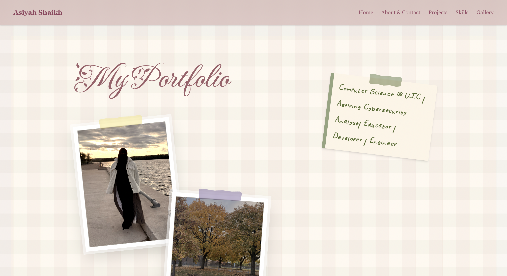
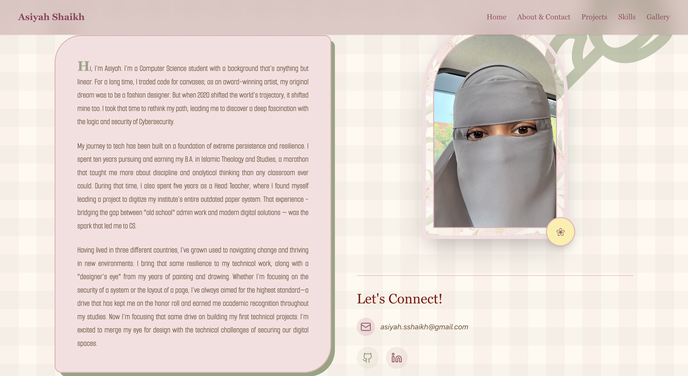
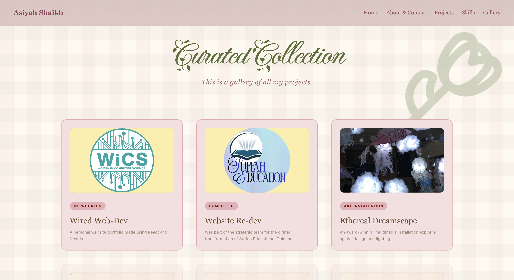
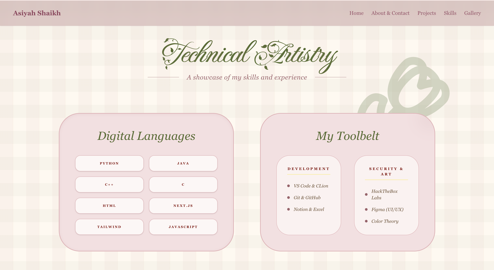
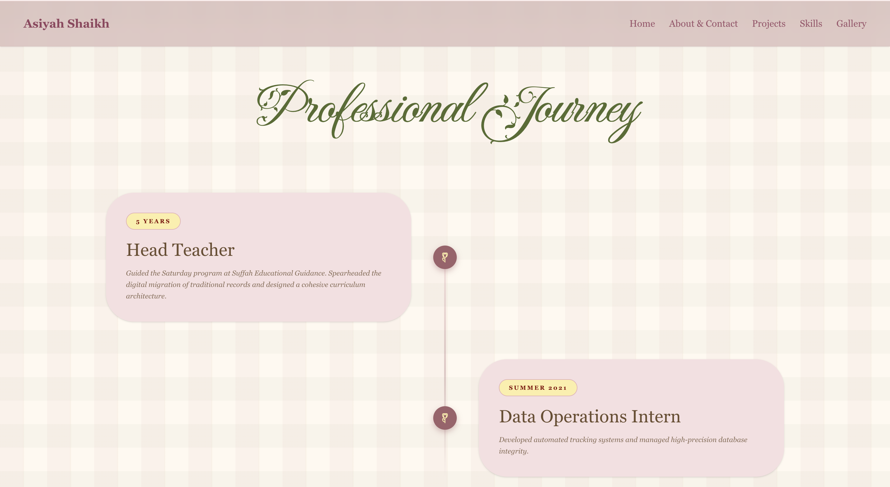
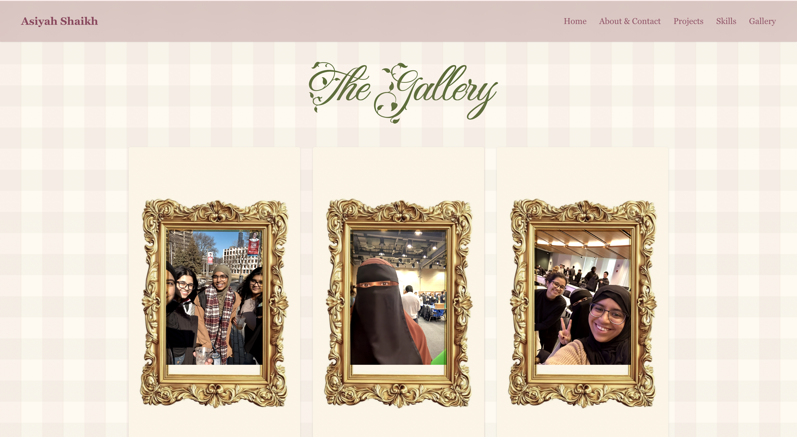
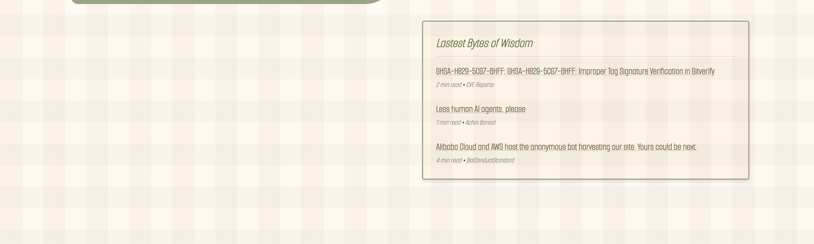
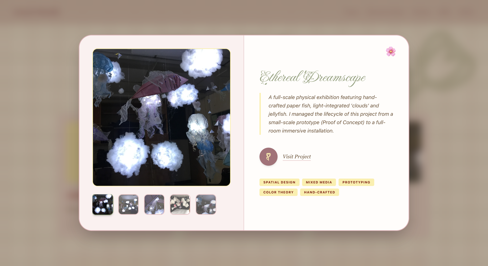

This is a [Next.js](https://nextjs.org) project bootstrapped with [`create-next-app`](https://nextjs.org/docs/app/api-reference/cli/create-next-app).

## 🌸 Personal Portfolio and Website 2026 🌸
### Asiyah Shaikh • Computer Science Student @ University of Illinois Chicago

**Live Site:** [asiyah-personal-website.vercel.app](https://asiyah-personal-website.vercel.app/) &nbsp;|&nbsp; **LinkedIn:** [linkedin.com/in/asiyah-shaikh](https://www.linkedin.com/in/asiyah-shaikh/)

A personal portfolio and "digital garden" built from the ground up as part of the **WiCS Wired Web-Dev Program** at UIC. Instead of a standard tech portfolio, this site is designed to feel like a curated scrapbook — a mix of software engineering and my own artwork and design sensibility.

---

## 📋 Table of Contents
- [About the Project](#about-the-project)
- [Pages & Features](#pages--features)
- [Screenshots](#screenshots)
- [Tech Stack](#tech-stack)
- [Getting Started](#getting-started)

---

## About the Project

This site serves as my living portfolio — a place to archive coding projects, creative installations, and academic work as I transition into the cybersecurity and software development space. The design uses a pastel/spring color palette (`#9E616A` Rose / `#FCEEA8` Sunshine Yellow) with a custom handwriting font and high-intensity backdrop-blur navigation for a truly unique "Welcome" experience.

The project is built with a **security-first mindset**, applying secure web practices and Git-based version control throughout the full development lifecycle.

---

## Pages & Features

| Page | Description |
|---|---|
| **Home** | Scrapbook-style landing page with polaroid photo layout and handwritten welcome note |
| **About & Contact** | Personal bio, professional journey timeline, and contact links |
| **Projects** | Curated collection of technical and creative projects with status tags |
| **Skills** | Digital languages and toolbelt displayed in a custom card layout |
| **Gallery** | Media-first gallery with a custom React modal system for high-resolution photos and `.mp4` video, displayed in ornate gold frames |
| **Cybersecurity Feed** | Live "Latest Bytes of Wisdom" feed — a real-time API integration pulling current CVE reports and cybersecurity news |

---

## Screenshots

### Home


### About & Contact


### Projects — Curated Collection


### Skills — Technical Artistry


### Experiences - My Journey


### Gallery


### Cybersecurity News Feed


### Project Detail — Ethereal Dreamscape


---

## Tech Stack

| Category | Tools |
|---|---|
| **Core** | Next.js 14, React, TypeScript |
| **Styling** | Tailwind CSS, Framer Motion |
| **Fonts** | Custom handwriting font via `next/font/local` |
| **Deployment** | Vercel |
| **Version Control** | Git & GitHub |
| **Design** | Figma, VS Code |

---

## Getting Started

Clone the repository and run the development server locally:

```bash
git clone https://github.com/ashaikhpatel/personal-website-2026.git
cd personal-website-2026
npm install
npm run dev
```

Open [http://localhost:3000](http://localhost:3000) in your browser to view the site.

---


